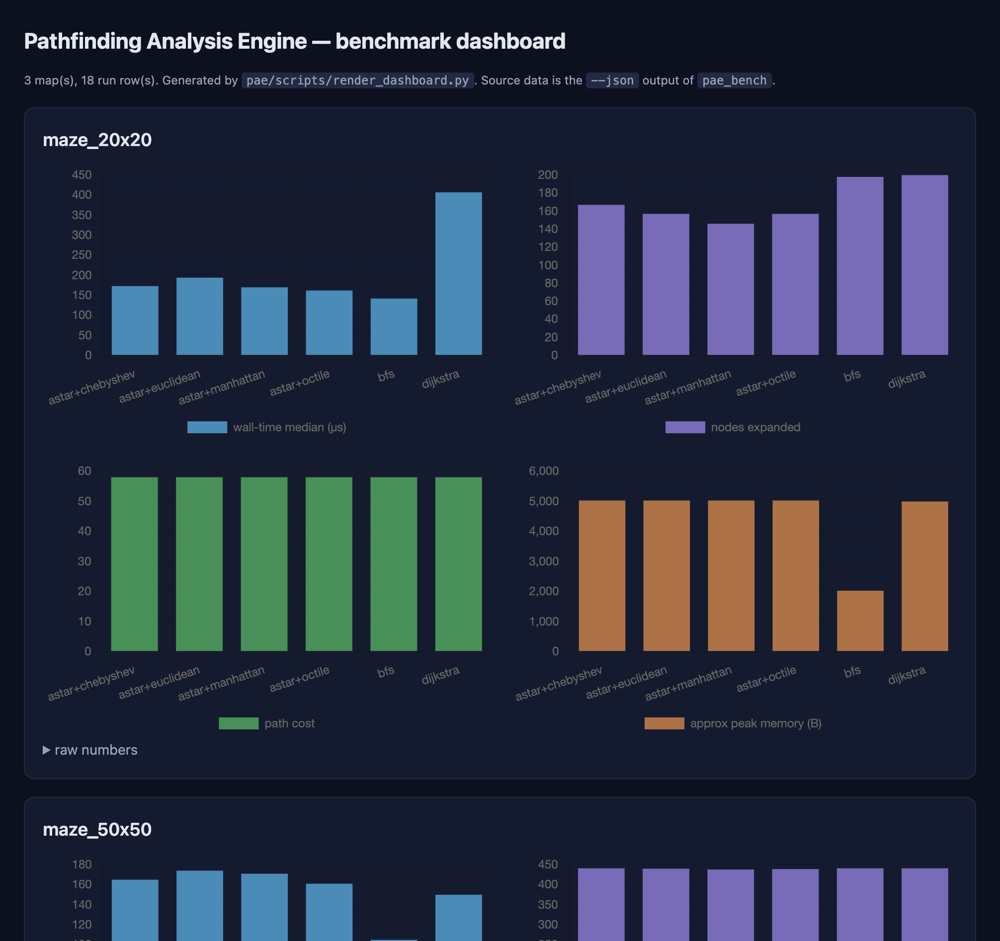

# Pathfinding Analysis Engine with Heuristic Visualization (PAE)

> A modular, OOP-first C++17 engine that compares pathfinding algorithms
> (A\*, Dijkstra, BFS) under pluggable heuristics (Manhattan, Euclidean,
> Chebyshev, Octile) on 2D grids — with step-by-step CLI visualization
> and per-run performance metrics (including optional OS-level RSS).

This repository is a **production-quality engineering blueprint**, not a
toy visualizer. It is designed to demonstrate:

- Strong problem-solving and algorithmic depth (A\*, Dijkstra, BFS, with
  optimality / admissibility proofs in `docs/ALGORITHMS.md`).
- Clean Low-Level Design (LLD) with abstraction, inheritance,
  polymorphism, and separation of concerns.
- Extensibility — add a new algorithm or heuristic without touching the
  CLI, the metrics layer, or any other algorithm.
- Measurable performance comparison across algorithms and heuristics.
- A real Software Development Life Cycle (SDLC) modelled on the
  `ssm_calender` and `Jyotish AI` projects in this repo collection
  (Copilot agents, prompt library, CI/CD, structured docs).

---

## TL;DR — Quick start

```bash
# 1. Configure + build with the bundled CMake preset (debug + tests).
cd pae
cmake --preset debug
cmake --build --preset debug

# 2. Run a single algorithm with step-by-step CLI visualization.
./build/debug/pae --map maps/maze_20x20.txt \
                 --algo astar \
                 --heuristic octile \
                 --visualize step

# 3. Compare all algorithms × heuristics on the same map.
./build/debug/pae --map maps/maze_50x50.txt --benchmark

# 4. Run the full unit-test suite (44 cases via Catch2).
ctest --preset debug

# 5. Sanitizer build (ASan + UBSan) — same tests, stricter runtime.
cmake --workflow --preset ci-san

# 6. Sweep every map and write JSON benchmark results.
bash scripts/run-benchmarks.sh
```

> Don't have CMake 3.25? Fall back to the long form:
> `cmake -S pae -B pae/build -G Ninja -DCMAKE_BUILD_TYPE=Debug && cmake --build pae/build -j`.

> Want OS-level RSS in the metrics output? Configure with the `rss`
> preset: `cmake --preset rss && cmake --build --preset rss`.

---

## Implementation status

The repository contains a **complete, working** revision of the engine.
It is not a stub. As of the latest commit it has been built, tested,
sanitised, and benchmarked locally on Apple clang 21:

| Layer | Status | Evidence |
|---|---|---|
| Build (`CMake + Ninja`, `-Wall -Wextra -Werror`) | green | 0 warnings on 154 build steps |
| Unit + property + cross-algorithm tests | **44 / 44 pass** | `ctest --preset debug` |
| Sanitizer build (`-fsanitize=address,undefined`) | **44 / 44 pass**, no findings | `cmake --workflow --preset ci-san` |
| RSS-enabled build (`PAE_TRUE_RSS=ON`) | green | `pae` summary now prints `rss_delta_B`; benchmark JSON gains `rss_delta_bytes` |
| End-to-end CLI on every map | green | see [`docs/PERFORMANCE.md`](docs/PERFORMANCE.md) and the table below |
| Benchmark harness on every map (`scripts/run-benchmarks.sh`) | green | JSON outputs in `pae/benchmarks/results/` (gitignored) |

**Sample comparison** — `pae --benchmark --map pae/maps/open_arena_50x50.txt`:

```text
algorithm   heuristic    expanded    wall_us(med)   wall_us(p95)   path_len   path_cost   memory_B
astar       manhattan         992             505             523        103         102      39600
astar       octile           1371             577             623        103         102      32464
astar       euclidean        1425             537             574        103         102      32112
astar       chebyshev        1447             612             632        103         102      32080
bfs         -                1726             300             314        103         102      12672
dijkstra    -                1726             594             634        103         102      31408
```

Every configuration agrees on the optimal path (length 103, cost 102),
and the heuristic ranking is **textbook-correct on a 4-connected grid**:
Manhattan (tightest 4-conn h) < Octile < Euclidean < Chebyshev <
BFS / Dijkstra (h ≡ 0). Octile sits where you'd expect — admissible for
4-conn but loose, because its tightness target is 8-conn-with-diagonal-√2.

The **weighted_small.txt** map showcases the BFS-vs-weighted divergence:

| Algorithm | Path length (steps) | Path cost (weighted) |
|---|---|---|
| `bfs` | 6 (shortest by hops) | ignores weights, 5 |
| `dijkstra` | 8 (detour) | **7 (optimal)** |
| `astar` (Manhattan) | 8 (detour) | **7 (optimal)** |

This is the exact textbook result the project brief asks the engine to demonstrate.

---

## Visualizing benchmark results

The benchmark output isn't just a table any more — there are two visual
layers on top of the same data:

### 1. In-terminal ASCII bar charts

Every `pae --benchmark` run now follows the table with normalised
horizontal bar charts for wall-time, nodes expanded, path cost, and
peak memory. Each algorithm gets its own ANSI colour (astar = green,
dijkstra = cyan, bfs = yellow). Pass `--no-color` for snapshot-safe
plain ASCII.

```text
wall-time median (lower is faster)
  astar manhattan        |################################        |        579 us
  astar octile           |#######################################  |        705 us
  bfs -                  |#######################################  |        701 us
  dijkstra -             |########################################|        720 us

nodes expanded (lower = more directed search)
  astar manhattan        |#######################                  |        992
  bfs -                  |########################################|       1726
  dijkstra -             |########################################|       1726
```

### 2. Self-contained HTML dashboard (Chart.js)

```bash
# Sweep every map AND render an HTML dashboard from the JSON outputs.
bash pae/scripts/run-benchmarks.sh

# Open the latest dashboard in your default browser:
open pae/benchmarks/results/dashboard-latest.html   # macOS
xdg-open pae/benchmarks/results/dashboard-latest.html  # Linux
```

The dashboard is a single self-contained HTML file. It loads
[Chart.js](https://www.chartjs.org/) from jsDelivr (with a verified
SRI hash so the browser rejects a tampered CDN response) and renders:

- a card per map with bar charts for wall-time, expanded, path cost, and memory;
- a "raw numbers" `<details>` table you can copy/paste;
- a cross-map comparison section that puts every map on the same axes.

The renderer is `pae/scripts/render_dashboard.py` — Python 3 stdlib
only, no `pip install` required. You can also point it at any pile
of `pae_bench --json` outputs:

```bash
pae/build/release/benchmarks/pae_bench --map pae/maps/maze_50x50.txt --json > maze.json
python3 pae/scripts/render_dashboard.py maze.json -o dashboard.html
```

Snapshot of the rendered dashboard (3 maps, 18 run rows):



---

## Where to look

| Area | Path |
|------|------|
| **Project plan / blueprint** | [`docs/IMPLEMENTATION_PLAN.md`](docs/IMPLEMENTATION_PLAN.md) |
| **How to add a new algorithm (walkthrough)** | [`docs/TUTORIAL.md`](docs/TUTORIAL.md) |
| **System architecture** | [`docs/ARCHITECTURE.md`](docs/ARCHITECTURE.md) |
| **Architecture / class / sequence diagrams** | [`design/diagrams.md`](design/diagrams.md) |
| **Low-Level Design (classes, UML)** | [`docs/LLD.md`](docs/LLD.md) |
| **Algorithm deep dive** | [`docs/ALGORITHMS.md`](docs/ALGORITHMS.md) |
| **Heuristic design** | [`docs/HEURISTICS.md`](docs/HEURISTICS.md) |
| **Data-structure choices** | [`docs/DATA_STRUCTURES.md`](docs/DATA_STRUCTURES.md) |
| **Folder structure** | [`docs/FOLDER_STRUCTURE.md`](docs/FOLDER_STRUCTURE.md) |
| **Requirements** | [`docs/REQUIREMENTS.md`](docs/REQUIREMENTS.md) |
| **Feature tracker** | [`docs/FEATURES.md`](docs/FEATURES.md) |
| **Bug tracker** | [`docs/BUGS.md`](docs/BUGS.md) |
| **Changelog** | [`docs/CHANGELOG.md`](docs/CHANGELOG.md) |
| **Roadmap** | [`docs/ROADMAP.md`](docs/ROADMAP.md) |
| **Testing strategy** | [`docs/TESTING.md`](docs/TESTING.md) |
| **Performance plan** | [`docs/PERFORMANCE.md`](docs/PERFORMANCE.md) |
| **Extensions** | [`docs/EXTENSIONS.md`](docs/EXTENSIONS.md) |
| **Agent definitions** | [`AGENTS.md`](AGENTS.md) |
| **Copilot master rules** | [`.github/copilot-instructions.md`](.github/copilot-instructions.md) |
| **GitHub setup** | [`.github/SETUP_GITHUB.md`](.github/SETUP_GITHUB.md) |

---

## Tech stack

| Layer | Choice | Why |
|-------|--------|-----|
| Language | **C++17** | RAII, `std::optional`, `if constexpr`, structured bindings; broadly supported. |
| Build | **CMake ≥ 3.20** | Multi-platform, well-understood, integrates with CTest. |
| Tests | **Catch2 v3** (FetchContent) | Header-only-ish, expressive `REQUIRE` semantics, no external deps. |
| Bench | **Custom microbench harness** + optional **Google Benchmark** | Avoid framework lock-in for the core; opt-in to GB for stable numbers. |
| Lint | **clang-tidy + clang-format** (LLVM style) | Industry-standard, deterministic CI. |
| CI | **GitHub Actions** | Parity with `ssm_calender` / `Jyotish AI`. |
| Docs | **Markdown** | Render natively on GitHub; same pattern as sibling projects. |

External dependencies are **fetched at configure time** (Catch2 only) — there
is no system-wide install requirement beyond a C++17 compiler and CMake.

---

## What this is **not**

- Not a game engine, not a graphics-API demo, not a GUI app.
- Not a "framework" — it is one binary plus reusable libraries.
- Not coupled to any concrete heuristic, algorithm, map format, or
  visualization channel — every one of those is behind an interface.

---

## Sibling projects (SDLC parents)

This project follows the same SDLC, agent, prompt, and CI structure as:

- [`../ssm_calender`](../ssm_calender) — Marathi panchang calendar
  (TypeScript / Next.js) — the **structural parent**: `docs/`, `.github/`,
  `AGENTS.md`, `prompts/`, `instructions/`, `workflows/`.
- [`../Jyotish AI`](../Jyotish%20AI) — Vedic astrology engine
  (Python / FastAPI / Next.js) — the **methodological parent**:
  phased master plan, layer-by-layer ship prompts, CHANGELOG-driven
  releases.

If you have worked on either of those repos, the workflow here is
identical — only the tools (`pytest` → `ctest`, `tsc` → `clang-tidy`,
`vitest` → `Catch2`) change.

---

## License

MIT — see [`LICENSE`](LICENSE).
