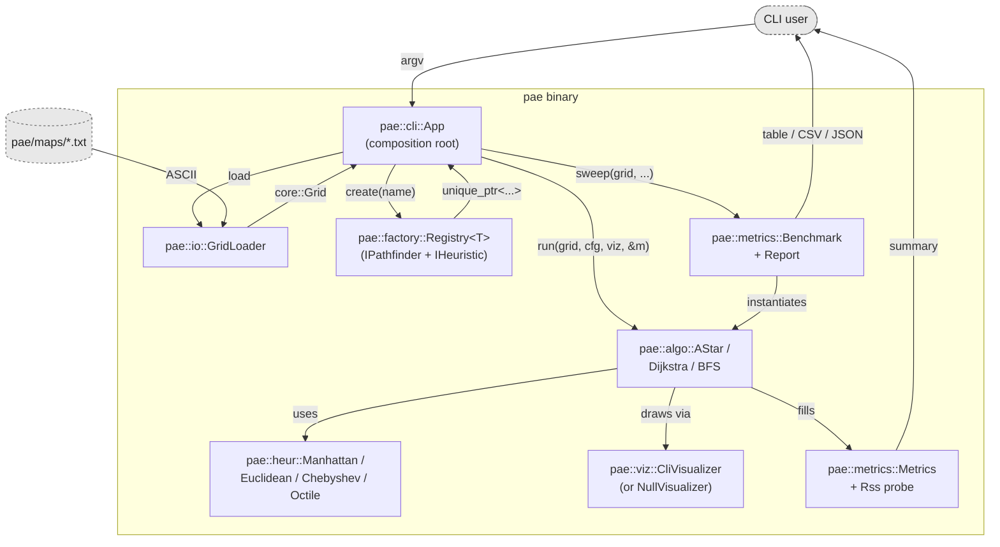
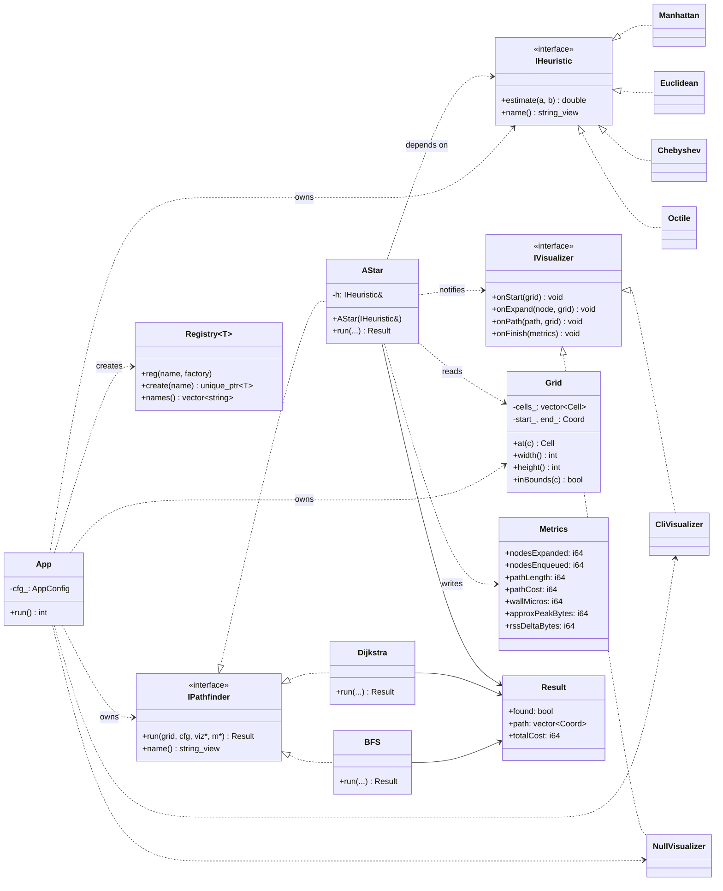
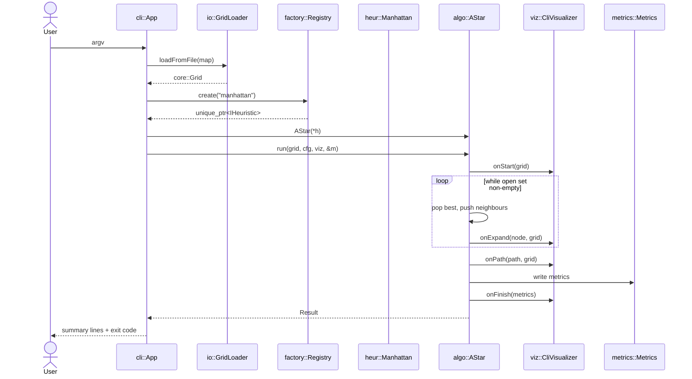
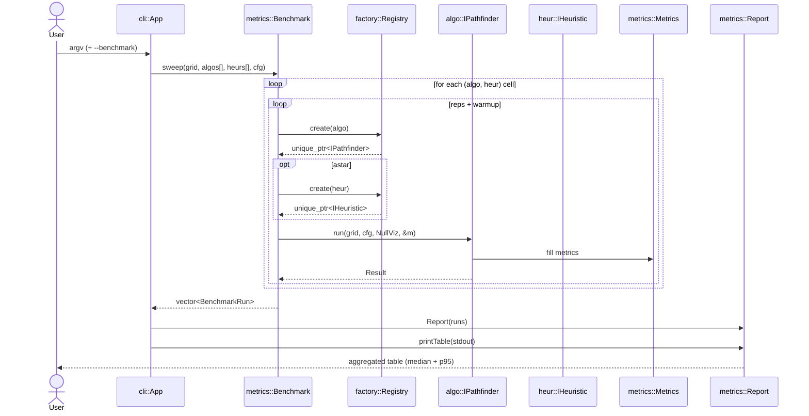

# Pathfinding Analysis Engine — visual artifacts

> Source-controlled Mermaid diagrams. GitHub renders the fences below
> inline; you do not need a local Mermaid CLI to read them. Each diagram
> is also kept as a standalone `.mmd` file so it can be imported into a
> design tool without re-extracting.

## 1. Component view

> File: [`architecture.mmd`](./architecture.mmd) — kept in sync with
> `docs/ARCHITECTURE.md`.

---

## 2. UML class diagram

> File: [`class_diagram.mmd`](./class_diagram.mmd) — mirrors
> `docs/LLD.md` signatures. **If a class signature changes in code,
> change this file in the same PR.**

---

## 3. Single-run sequence

> File: [`sequence_run.mmd`](./sequence_run.mmd).

---

## 4. Benchmark sweep sequence

> File: [`sequence_benchmark.mmd`](./sequence_benchmark.mmd).

